---
HTML_ANALYSIS:
- Screens found: 20 pages total - index.html, login.html, register.html, dashboard.html, bookings.html, booking-create.html, products.html, availability.html, customers.html, maintenance.html, staff.html, reports.html, settings.html, catalog.html, admin-dashboard.html, admin-outlets.html, admin-users.html, admin-subscriptions.html, admin-reports.html, admin-settings.html (with 4 tabs: System, Roles, Pricing Plans, Email Templates)
- Entities found: Outlet, User, Customer, Product, Booking, Maintenance, Invoice, Payment, Subscription, Role, Permission, Pricing Plan, Email Template
- Forms found: Login, Register, Customer, Product, Booking (3-step), Staff, Maintenance, Pelunasan, Outlet, System Config, Role, Pricing Plan, Email Template
- Statuses found: Booking (Dikonfirmasi, Aktif, Selesai, Overdue), Product (Tersedia, Disewa, Maintenance), Customer (Aktif, Diblokir), Maintenance (Scheduled, In Progress, Completed), Outlet (Active, Trial, Inactive), Staff (Active, Inactive)
- Multi-tenancy indicators: Super Admin sidebar, outlet selector in admin-users, outlet name display in sidebar "Sepatu Rental / Sepatu Rental", outlet stats in admin pages
- Permission system: 85 total permissions across 7 groups (user, role, product, booking, payment, tenant, report)
- Subscription plans: 4 tiers (Trial, Basic, Pro, Enterprise) with limits and add-ons
- Unclear/ambiguous: none
---

# Technical Documentation - POS Rental

## 1. Project Scope

### Batas Sistem (In Scope)

**Frontend Features yang Terlihat di Mockup:**
- Sistem autentikasi (Login, Register)
- Multi-role dashboard dengan permission-based navigation
- Manajemen produk dengan kategori, size, dan unit tracking
- Booking system dengan 3-step wizard (Customer → Produk & Tanggal → Pembayaran)
- Sistem pembayaran DP (Down Payment) dan pelunasan
- Kalender availability interaktif per produk
- Manajemen customer dengan blacklist functionality
- Maintenance tracking per unit produk
- Staff management dengan permission assignment
- Reporting dengan charts dan export (PDF/Excel)
- Multi-tenant super admin panel dengan:
  - System configuration (app name, trial duration, timezone, maintenance mode)
  - Role & permission management (85 permissions, 7 groups)
  - Pricing plan configuration (4 tiers dengan limits dan add-ons)
  - Email template editor dengan multi-channel (Email, WhatsApp, Push)
- Subscription dan billing management
- Public catalog page dengan WhatsApp integration

### Yang TIDAK Ada di Mockup

- **Tidak ada indikasi fitur yang "coming soon"** - semua tombol dan menu terlihat aktif dan fungsional
- **Tidak ada halaman error handling** (404, 500, etc.) - tidak terlihat di mockup
- **Tidak ada notifikasi real-time UI** - hanya badge count di icon bell, tapi tidak ada tampilan notifikasi detail
- **Tidak ada chat/messaging system** - hanya WhatsApp integration external link
- **Tidak ada bulk operations** (bulk edit, bulk delete) di tabel

### Platform Target

**Web Platform - Responsive Design:**
- Desktop-first dengan sidebar navigation (fixed 256px width)
- Mobile responsive indicators: responsive grid (grid-cols-1 md:grid-cols-2 lg:grid-cols-3 xl:grid-cols-4)
- Breakpoints: md (768px), lg (1024px), xl (1280px)
- Touch-friendly UI dengan button sizes yang cukup besar (min 40px)

**Evidence dari HTML:**
```html
<meta name="viewport" content="width=device-width, initial-scale=1.0">
```
- Tailwind responsive classes: `md:grid-cols-2`, `lg:grid-cols-3`, `hidden md:block`

### Bahasa/Locale

**Bahasa Indonesia (id):**
- HTML lang: `<html lang="id">`
- Semua label, form, dan UI text dalam Bahasa Indonesia
- Format tanggal: "15 Apr 2024", "Selasa, 15 April 2024"
- Format mata uang: "Rp 850.000", "Rp 23.5M"
- Number format dengan locale 'id-ID': `toLocaleString('id-ID')`

---

## 2. System Overview

### Arsitektur Modul (Tekstual)

```
┌─────────────────────────────────────────────────────────────────────┐
│                        POS RENTAL SYSTEM                            │
├─────────────────────────────────────────────────────────────────────┤
│                                                                     │
│  ┌─────────────────┐  ┌─────────────────┐  ┌─────────────────────┐  │
│  │   PUBLIC LAYER  │  │  TENANT LAYER   │  │   SUPER ADMIN       │  │
│  │                 │  │                 │  │                     │  │
│  │ • Catalog       │  │ • Dashboard     │  │ • Dashboard         │  │
│  │   (Landing)     │  │ • Booking       │  │ • Manage Outlets    │  │
│  │ • WhatsApp      │  │ • Products      │  │ • Manage Users      │  │
│  │   Integration   │  │ • Availability  │  │ • Subscriptions     │  │
│  │                 │  │ • Customers     │  │ • System Reports    │  │
│  │                 │  │ • Maintenance   │  │                     │  │
│  │                 │  │ • Staff         │  │                     │  │
│  │                 │  │ • Reports       │  │                     │  │
│  │                 │  │ • Settings      │  │                     │  │
│  └─────────────────┘  └─────────────────┘  └─────────────────────┘  │
│                                                                     │
│  ┌──────────────────────────────────────────────────────────────┐  │
│  │                      SHARED MODULES                          │  │
│  │                                                              │  │
│  │  ┌──────────────┐  ┌──────────────┐  ┌──────────────────┐   │  │
│  │  │   AUTH       │  │  PAYMENT     │  │   NOTIFICATION   │   │  │
│  │  │              │  │              │  │                  │   │  │
│  │  │ • Login      │  │ • DP System  │  │ • Email          │   │  │
│  │  │ • Register   │  │ • Pelunasan  │  │ • WhatsApp       │   │  │
│  │  │ • Roles      │  │ • Invoice    │  │ • In-App         │   │  │
│  │  └──────────────┘  └──────────────┘  └──────────────────┘   │  │
│  └──────────────────────────────────────────────────────────────┘  │
│                                                                     │
└─────────────────────────────────────────────────────────────────────┘
```

### Multi-Tenancy Indicators

**Evidence Multi-Tenant Architecture:**

1. **Sidebar Outlet Identity:**
   ```html
   <h1 class="text-lg font-bold text-slate-900">POS Rental</h1>
   <p class="text-xs text-slate-500">Sepatu Rental</p>  <!-- Outlet name -->
   ```

2. **Super Admin Panel terpisah:**
   - Sidebar berwarna ungu (gradient from-purple-900 to-indigo-900)
   - Logo dengan crown icon
   - Menu: Dashboard, Outlets, Users, Subscriptions, Reports, Settings

3. **Outlet Selector di Admin Users:**
   ```html
   <select>
       <option value="">Semua Outlet</option>
       <option value="OUT-001">Sepatu Premium Jakarta</option>
       <option value="OUT-002">Sport Rental Bandung</option>
   </select>
   ```

4. **Outlet Stats di Admin:**
   - Total Outlets: 127
   - Active, Trial, Inactive counts
   - Outlet-specific metrics

5. **User-Outlet Association:**
   ```javascript
   { id: 1, name: 'Pak Budi', outlet: 'Sepatu Premium Jakarta', outletId: 'OUT-001', role: 'owner' }
   ```

### Relasi Antar Modul (yang Terlihat di UI)

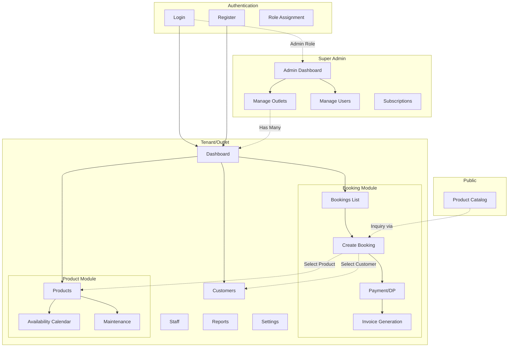

---

## 3. Module Breakdown

### Modul Dashboard

| Atribut | Detail |
|---------|--------|
| **Nama Modul** | Dashboard |
| **Screens** | Main Dashboard |
| **Entitas Utama** | Metrics (Pendapatan, Booking, Produk, Terlambat) |
| **Aksi CRUD** | Read only, View Detail (klik booking untuk lihat detail) |
| **Filter/Search** | Period selector (7 Hari, 30 Hari, 90 Hari) untuk revenue chart |

### Modul Booking

| Atribut | Detail |
|---------|--------|
| **Nama Modul** | Booking / Manajemen Booking |
| **Screens** | Booking List, Booking Baru (Create), Detail Modal, Edit Modal, Invoice Modal, Payment Modal (Pelunasan) |
| **Entitas Utama** | Booking/Transaksi Rental |
| **Aksi CRUD** | Create (Booking Baru), Read (Detail, Invoice), Update (Edit), Delete tidak terlihat |
| **Filter/Search** | Search (Cari booking), Filter Status (Semua, Dikonfirmasi, Aktif, Selesai) |

### Modul Produk

| Atribut | Detail |
|---------|--------|
| **Nama Modul** | Produk / Manajemen Produk |
| **Screens** | Product List (Grid), Add/Edit Modal, View Detail Modal |
| **Entitas Utama** | Produk (Nama, SKU, Kategori, Size, Stock, Harga) |
| **Aksi CRUD** | Create (Tambah Produk), Read (View Detail), Update (Edit), Delete tidak terlihat |
| **Filter/Search** | Search (Cari produk), Filter Kategori (Futsal, Basket, Running), Filter Status (Tersedia, Disewa, Maintenance) |

### Modul Ketersediaan

| Atribut | Detail |
|---------|--------|
| **Nama Modul** | Ketersediaan / Kalender Ketersediaan |
| **Screens** | Calendar View, Day Detail Modal |
| **Entitas Utama** | Product Availability per tanggal |
| **Aksi CRUD** | Read only, View Day Detail |
| **Filter/Search** | Search (Cari produk), Filter Kategori, Month Navigation (prev/next) |

### Modul Customer

| Atribut | Detail |
|---------|--------|
| **Nama Modul** | Customer / Manajemen Customer |
| **Screens** | Customer List (Grid), Add Modal, View Detail Modal |
| **Entitas Utama** | Customer (Nama, No. HP, Email, Alamat, Status) |
| **Aksi CRUD** | Create (Tambah Customer), Read (Detail), Update (Edit - implisit), Delete (Blacklist - soft delete) |
| **Filter/Search** | Search (Cari customer), Filter Status (Aktif, Diblokir) |

### Modul Maintenance

| Atribut | Detail |
|---------|--------|
| **Nama Modul** | Maintenance / Manajemen Maintenance |
| **Screens** | Maintenance List (per product), Schedule Modal, Detail View |
| **Entitas Utama** | Maintenance Record (Unit, Jenis, Tanggal, Progress, Biaya) |
| **Aksi CRUD** | Create (Schedule Maintenance), Read (View Detail), Update (Update Progress), Complete (Mark as done) |
| **Filter/Search** | Filter Status (Scheduled, In Progress, Completed), Filter Jenis (Cuci, Perbaikan, Inspeksi) |

### Modul Staff

| Atribut | Detail |
|---------|--------|
| **Nama Modul** | Staff / Manajemen Staff |
| **Screens** | Staff List (Grid), Add/Edit Modal, Detail View |
| **Entitas Utama** | Staff/User (Nama, Email, No. HP, Role, Status, Permissions) |
| **Aksi CRUD** | Create (Tambah Staff), Read (Detail), Update (Edit), Delete tidak terlihat |
| **Filter/Search** | Search (Cari staff), Filter Role (Owner, Manager, Kasir, Inventory), Filter Status (Active, Inactive) |

### Modul Laporan

| Atribut | Detail |
|---------|--------|
| **Nama Modul** | Laporan / Laporan & Analisis |
| **Screens** | Reports Dashboard dengan charts dan tables |
| **Entitas Utama** | Revenue data, Booking data, Product performance, Customer analytics |
| **Aksi CRUD** | Read only, Export |
| **Filter/Search** | Period selector (Per Bulan, Per Tahun, Custom), Month/Year selector |

### Modul Pengaturan

| Atribut | Detail |
|---------|--------|
| **Nama Modul** | Pengaturan / Settings |
| **Screens** | Settings dengan tabs |
| **Entitas Utama** | Profile, Business, Payment, Notifications, Outlet, Subscription |
| **Aksi CRUD** | Update (Edit dan Simpan per tab) |
| **Filter/Search** | Tab navigation (Profil, Bisnis, Pembayaran, Notifikasi, Outlet, Langganan) |

### Modul Super Admin - Manage Outlets

| Atribut | Detail |
|---------|--------|
| **Nama Modul** | Outlets / Manage Outlets |
| **Screens** | Outlet Grid, Add/Edit Modal |
| **Entitas Utama** | Outlet (ID, Nama, Owner, Email, Status, Join Date) |
| **Aksi CRUD** | Create (Tambah Outlet), Read (View), Update (Edit) |
| **Filter/Search** | Search (Cari outlet), Filter Status (Active, Trial, Inactive) |

### Modul Super Admin - Manage Users

| Atribut | Detail |
|---------|--------|
| **Nama Modul** | Users / Manage Users |
| **Screens** | Users Table |
| **Entitas Utama** | User (Name, Email, Outlet, Role, Status, Last Login) |
| **Aksi CRUD** | Read (View), Update (Suspend - status change), Delete tidak terlihat |
| **Filter/Search** | Search (Cari user), Filter Outlet, Filter Role (Owner, Admin, Kasir) |

### Modul Super Admin - System Settings

| Atribut | Detail |
|---------|--------|
| **Nama Modul** | Settings / System Settings |
| **Screens** | Settings dengan 4 tabs |
| **Entitas Utama** | System Config, Roles, Pricing Plans, Email Templates |
| **Aksi CRUD** | Create (Custom Role, New Plan), Read, Update (Edit semua settings), Delete (Custom Role) |
| **Tabs** | System Configuration, Roles & Permissions, Pricing Plans, Email Templates |

**Tab 1: System Configuration**

| Setting | Type | Value/Default |
|---------|------|---------------|
| Application Name | text | "POS Rental System" |
| Support Email | email | "support@posrental.com" |
| Default Trial Duration (Days) | number | 14 |
| Timezone | select | Asia/Jakarta (WIB), Asia/Makassar (WITA), Asia/Jayapura (WIT) |

**Feature Toggles:**
- `Allow New Outlet Registrations` - Boolean toggle (default: ON)
- `Maintenance Mode` - Boolean toggle (default: OFF) - Tutup akses aplikasi untuk semua tenant kecuali Super Admin

**Tab 2: Roles & Permissions**

| Komponen | Detail |
|----------|--------|
| **Role Types** | System (Default), Custom |
| **System Roles** | Owner (85 permissions), Manager (62 permissions), Staff/Kasir (30 permissions), Inventory Staff (35 permissions) |
| **Custom Roles** | Can be created with specific permissions (e.g., Customer Service with 15 permissions) |
| **Permission Categories** | user, role, product, booking, payment, tenant, report |
| **Permission Actions** | create, read, update, delete, list, import, export, assign-role, cancel, checkin, checkout, refund, settings, billing, branding, view-dashboard, view-revenue |
| **Total Permissions** | 85 (displayed as "X / 85" in role table) |

**Permission Groups (dari Permission Matrix):**
- `user` - create, read, update, delete, list, assign-role
- `role` - create, read, update, delete, list
- `product` - create, read, update, delete, list, import, export
- `booking` - create, read, update, cancel, list-all, list-own, checkin, checkout
- `payment` - create, read, refund, list
- `tenant` - settings, billing, branding
- `report` - view-dashboard, view-revenue, export

**Tab 3: Pricing Plans**

| Plan | Price | Limits | Add-ons |
|------|-------|--------|---------|
| **Free Trial** | Rp 0 / 14 days | 1 Outlet, Max 5 Users, Max 50 Products | - |
| **Basic** | Rp 99K / month | 1 Outlet, Max 10 Users, Max 500 Products | - |
| **Pro** | Rp 199K / month | Up to 3 Outlets, Unlimited Users, Max 2000 Products | +Outlet (50k), +User (15k) |
| **Enterprise** | Rp 499K / month | Unlimited Outlets, Unlimited Users, Unlimited Products | - |

**Plan Configuration Fields:**
- Plan Name, Price, Interval (Monthly/Yearly)
- Core Limits: Max Outlets, Max Users, Max Products
- Accessible Features Toggles: Multi-Branch Sync, Inventory Tracking, Advanced Reporting, API Access & Webhooks, Custom Domain
- Add-ons: Additional Outlet (+1 Outlet @ Rp 50,000), Additional User (+1 User @ Rp 15,000)

**Tab 4: Email Templates (Communication Templates)**

**Event Triggers:**
- `auth_verify` - Verify Email Address
- `auth_forgot` - Forgot Password Reset
- `sub_remind` - Subscription Expiring Reminder
- `payment_success` - Payment Receipt
- `booking_created` - New Booking (Tenant)
- `overdue` - Overdue Return Warning

**Channel Tabs:**
- Email
- WhatsApp/Telegram
- Push Notification

**Template Variables:**
- `{{user_name}}`
- `{{outlet_name}}`
- `{{login_url}}`
- `{{trial_end_date}}`
- `{{otp_code}}` (untuk verify)
- `{{reset_url}}` (untuk forgot password)
- `{{verify_url}}`

---

## 4. Data Flow

### Flow 1: Booking Creation (3-Step Wizard)

```mermaid
flowchart LR
    A[Start: Klik Booking Baru] --> B[Step 1: Customer]
    B --> C{Customer exists?}
    C -->|Ya| D[Select Customer]
    C -->|Tidak| E[Add New Customer<br/>Nama, No. HP, Email, Alamat]
    E --> D
    D --> F[Step 2: Produk & Tanggal]
    F --> G[Select Produk]
    G --> H[Set Periode Sewa<br/>Start Date - End Date]
    H --> I[Custom Pickup/Return<br/>Optional - Date & Time]
    I --> J[Step 3: Pembayaran]
    J --> K{Pilih Jenis}
    K -->|DP| L[Input DP Amount<br/>Min. validation?]
    K -->|Lunas| M[Full Payment]
    L --> N[Select Metode<br/>Tunai/Transfer/QRIS/E-Wallet]
    M --> N
    N --> O[Save Booking]
    O --> P[Booking Dikonfirmasi]
```

### Flow 2: Booking Lifecycle (Status Transitions)

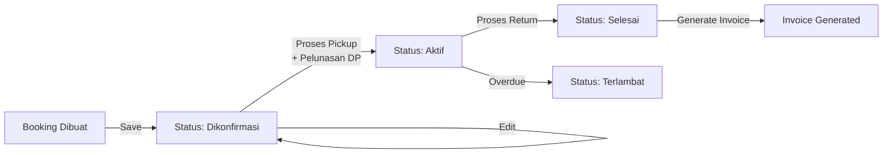

### Flow 3: Maintenance Flow

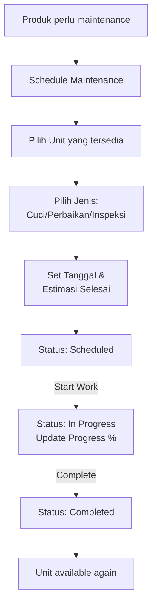

### Flow 4: Customer Blacklist Process

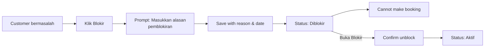

### Flow 5: Payment Settlement (Pelunasan)

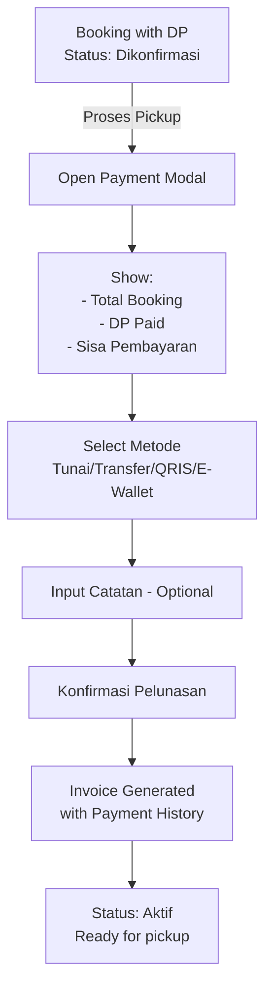

---

## 5. Status & State Machine

### Booking Status State Machine

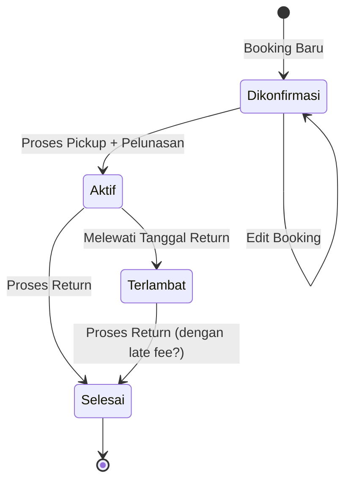

**Status Values (Verbatim dari HTML):**
- `Dikonfirmasi` (confirmed) - Badge: bg-blue-100 text-blue-800
- `Aktif` (active) - Badge: bg-green-100 text-green-800
- `Selesai` (completed) - Badge: bg-slate-100 text-slate-800
- `Terlambat` (overdue) - Badge: bg-red-100 text-red-800

**Actions per Status:**
- Dikonfirmasi: Edit (✓), Pickup (✓), Detail (✓)
- Aktif: Return (✓), Detail (✓)
- Selesai: Invoice (✓), Detail (✓)

### Product Status State Machine

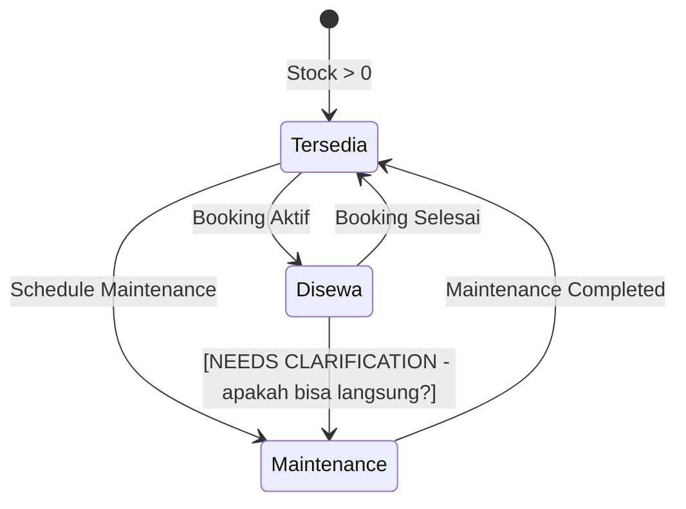

**Status Values (Verbatim dari HTML):**
- `Tersedia` (available) - Badge: bg-green-100 text-green-800
- `Disewa` (rented) - Badge: bg-blue-100 text-blue-800
- `Maintenance` - Badge: bg-yellow-100 text-yellow-800

### Customer Status State Machine

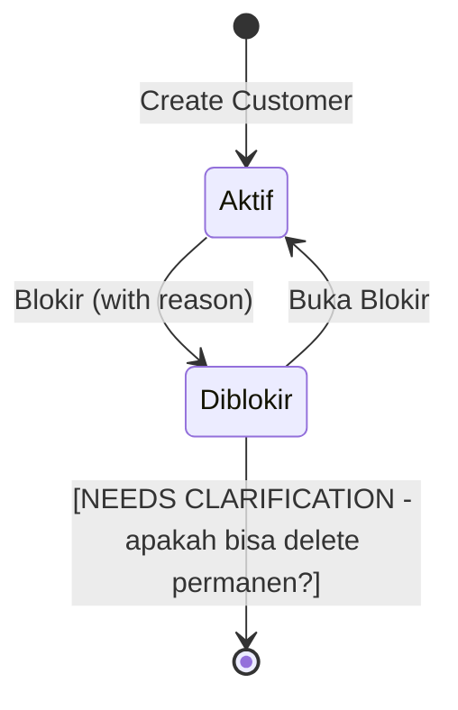

**Status Values (Verbatim dari HTML):**
- `Aktif` - Badge: implisit (default)
- `Diblokir` / `Blacklist` - Badge: bg-red-100 text-red-800 dengan label "DIBLOKIR"

**Blacklist Fields:**
- `blacklistReason` (text)
- `blacklistDate` (date)

### Maintenance Status State Machine

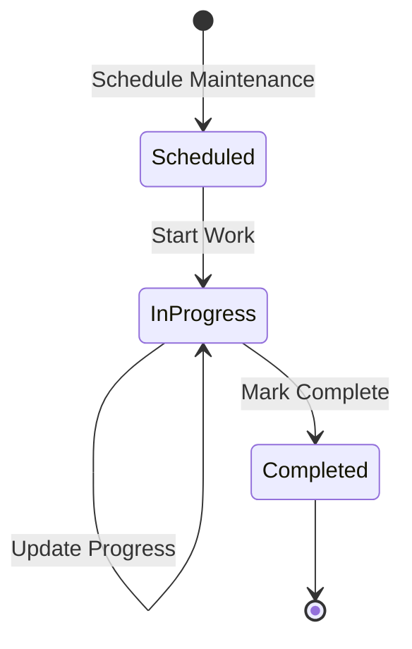

**Status Values (Verbatim dari HTML):**
- `Scheduled` - Badge: bg-blue-100 text-blue-800
- `In Progress` / `in_progress` - Badge: bg-yellow-100 text-yellow-800
- `Completed` - Badge: bg-green-100 text-green-800

### Outlet Status State Machine

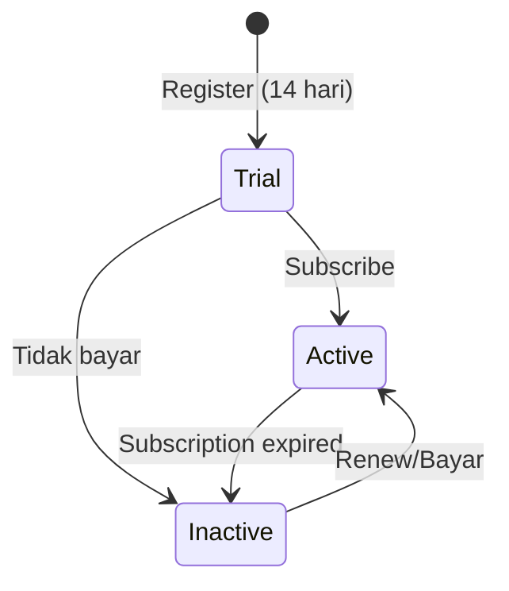

**Status Values (Verbatim dari HTML):**
- `Active` / `active` - Badge: bg-green-100 text-green-800
- `Trial` / `trial` - Badge: bg-yellow-100 text-yellow-800
- `Inactive` / `inactive` - Badge: bg-red-100 text-red-800

### Staff Status State Machine

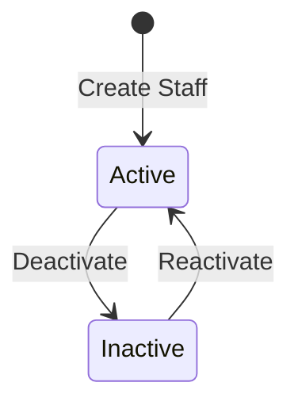

**Status Values (Verbatim dari HTML):**
- `Active` - Badge: bg-green-100 text-green-800
- `Inactive` - Badge: bg-slate-100 text-slate-800

---

## 6. Validation Rules

### Form: Login

| Field | Type | Required | Validation Hint |
|-------|------|----------|-----------------|
| Email | email | Yes | Placeholder: "nama@email.com" |
| Password | password | Yes | Placeholder: "••••••••" |
| Ingat saya | checkbox | No | - |

### Form: Register (Business + Owner)

| Field | Type | Required | Validation Hint |
|-------|------|----------|-----------------|
| Nama Bisnis | text | Yes | - |
| Jenis Bisnis | select | No | Options: Sepatu Olahraga, Alat Outdoor, Kamera & Elektronik, Perlengkapan Pesta, Lainnya |
| No. Telepon Bisnis | tel | No | Placeholder: "021-XXXXXXX" |
| Nama Lengkap | text | Yes | Placeholder: "Nama Anda" |
| No. HP | tel | Yes | Placeholder: "08XXXXXXXXX" |
| Email | email | Yes | Placeholder: "email@domain.com" |
| Password | password | Yes | Placeholder: "Min. 8 karakter" |
| Konfirmasi Password | password | Yes | Placeholder: "Ulangi password" |
| Terms Agreement | checkbox | Yes | required attribute present |

### Form: Tambah Customer

| Field | Type | Required | Validation Hint |
|-------|------|----------|-----------------|
| Nama Lengkap | text | Yes | - |
| No. HP | tel | Yes | - |
| Email | email | No | - |
| Alamat | textarea | No | rows="2" |

### Form: Tambah Produk

| Field | Type | Required | Validation Hint |
|-------|------|----------|-----------------|
| Nama Produk | text | Yes | - |
| SKU | text | Yes | - |
| Kategori | select | Yes | Options: Sepatu Futsal, Sepatu Basket, Sepatu Running |
| Size | text | Yes | - |
| Stock | number | Yes | - |
| Harga/Hari | number | Yes | - |
| Deskripsi | textarea | No | rows="3" |
| Foto | file | No | Helper: "PNG, JPG hingga 5MB" |

### Form: Booking Step 1 (Customer)

| Field | Type | Required | Validation Hint |
|-------|------|----------|-----------------|
| Pilih Customer | select | Yes | Options: List existing customers |
| Tambah Customer | button | - | Opens modal to add new customer |

### Form: Booking Step 2 (Produk & Tanggal)

| Field | Type | Required | Validation Hint |
|-------|------|----------|-----------------|
| Tanggal Mulai | date | Yes | - |
| Tanggal Selesai | date | Yes | - |
| Waktu Pickup (Custom) | date + time | No | Default: startDate + 09:00 |
| Waktu Return (Custom) | date + time | No | Default: endDate + 17:00 |
| Produk | selection | Yes | Multiple items with qty adjustment |

### Form: Booking Step 3 (Pembayaran)

| Field | Type | Required | Validation Hint |
|-------|------|----------|-----------------|
| Jenis Pembayaran | button toggle | Yes | DP Dulu / Lunas |
| Jumlah DP | number | Conditional | Only if DP selected, placeholder: "Masukkan jumlah DP" |
| Metode Pembayaran | select | Yes | Options: Tunai, Transfer Bank, QRIS, E-Wallet |
| Catatan | textarea | No | rows="3", placeholder: "Tambahkan catatan..." |

### Form: Pelunasan (Payment Settlement)

| Field | Type | Required | Validation Hint |
|-------|------|----------|-----------------|
| Metode Pembayaran | select | Yes | Options: Tunai, Transfer Bank, QRIS, E-Wallet |
| Catatan | textarea | No | rows="2", placeholder: "Catatan pembayaran..." |

**Note:** Form ini menampilkan info read-only:
- Total Booking (readonly display)
- DP Dibayar (readonly display)
- Sisa Pembayaran (readonly display, calculated)

### Form: Tambah Staff

| Field | Type | Required | Validation Hint |
|-------|------|----------|-----------------|
| Nama Lengkap | text | Yes | - |
| Email | email | Yes | - |
| No. HP | tel | Yes | - |
| Role | select | Yes | Options: Owner, Manager, Kasir, Inventory Staff |
| Password | password | Conditional | Required only for new staff |
| Konfirmasi Password | password | Conditional | Required only for new staff |
| Permissions | checkbox[] | No | Grid of checkboxes (booking, product, customer, payment, report permissions) |
| Kirim email undangan | checkbox | No | Default: checked |

### Form: Schedule Maintenance

| Field | Type | Required | Validation Hint |
|-------|------|----------|-----------------|
| Pilih Unit | button grid | Yes | Shows available units only, validation: "* Pilih unit yang akan di-maintenance" |
| Jenis Maintenance | select | Yes | Options: Cuci/Cleaning, Perbaikan, Inspeksi |
| Tanggal Mulai | date | Yes | - |
| Estimasi Selesai | date | Yes | - |
| Biaya | number | Yes | - |
| Catatan/Notes | textarea | No | - |

### Form: Tambah Outlet (Super Admin)

| Field | Type | Required | Validation Hint |
|-------|------|----------|-----------------|
| Nama Outlet | text | Yes | - |
| Nama Owner | text | Yes | - |
| Email | email | Yes | - |
| No. HP | tel | Yes | - |
| Alamat | textarea | No | rows="2" |
| Plan | select | Yes | Options: Trial (14 hari), Basic (Rp 99K/bulan), Pro (Rp 199K/bulan), Enterprise (Rp 499K/bulan) |
| Status | select | Yes | Options: Active, Trial, Inactive |

### Form: Super Admin - System Configuration

| Field | Type | Required | Validation Hint |
|-------|------|----------|-----------------|
| Application Name | text | Yes | - |
| Support Email | email | Yes | - |
| Default Trial Duration (Days) | number | Yes | Value: 14 |
| Timezone | select | Yes | Options: Asia/Jakarta (WIB), Asia/Makassar (WITA), Asia/Jayapura (WIT) |
| Allow New Outlet Registrations | toggle | No | Default: ON |
| Maintenance Mode | toggle | No | Default: OFF |

### Form: Super Admin - Create/Edit Role

| Field | Type | Required | Validation Hint |
|-------|------|----------|-----------------|
| Role Name | text | Yes | Disabled untuk System Roles |
| Description | text | Yes | Disabled untuk System Roles |
| Permissions | checkbox[] | No | 85 total permissions across 7 groups (user, role, product, booking, payment, tenant, report) |

**Permission Groups:**
- user:create, user:read, user:update, user:delete, user:list, user:assign-role
- role:create, role:read, role:update, role:delete, role:list
- product:create, product:read, product:update, product:delete, product:list, product:import, product:export
- booking:create, booking:read, booking:update, booking:cancel, booking:list-all, booking:list-own, booking:checkin, booking:checkout
- payment:create, payment:read, payment:refund, payment:list
- tenant:settings, tenant:billing, tenant:branding
- report:view-dashboard, report:view-revenue, report:export

### Form: Super Admin - Pricing Plan Configuration

| Field | Type | Required | Validation Hint |
|-------|------|----------|-----------------|
| Plan Name | text | Yes | Placeholder: "e.g. Pro Plan" |
| Price | number | Yes | Placeholder: "199000" |
| Interval | select | Yes | Options: Monthly, Yearly |
| Max Outlets | number | Yes | Default: 3 |
| Max Users | number | No | Placeholder: "Empty for unlimited" |
| Max Products | number | Yes | Default: 2000 |
| Accessible Features | checkbox[] | No | Multi-Branch Sync, Inventory Tracking, Advanced Reporting, API Access & Webhooks, Custom Domain |
| Add-on Item | select | No | +1 Additional Outlet, +1 Additional User |
| Add-on Price | number | No | Format: Rp (e.g., 50000) |
| Enable Add-on | toggle | No | Per add-on |

### Form: Super Admin - Email Template Editor

| Field | Type | Required | Validation Hint |
|-------|------|----------|-----------------|
| Event Trigger | select | Yes | Options: Verify Email, Forgot Password, Subscription Reminder, Payment Receipt, New Booking, Overdue Return |
| Channel | tabs | Yes | Email, WhatsApp/Telegram, Push Notification |
| Subject/Title | text | Conditional | Required untuk Email/Push |
| Message Body | textarea | Yes | rows="8", Supports variables |
| Enable this channel | toggle | No | Per channel per trigger |

**Available Template Variables:**
- `{{user_name}}`
- `{{outlet_name}}`
- `{{login_url}}`
- `{{trial_end_date}}`
- `{{otp_code}}`
- `{{reset_url}}`
- `{{verify_url}}`

---

## Data Type & Format Reference

| Data Type | Format Example | Evidence |
|-----------|---------------|----------|
| Date Display | "15 Apr 2024" | bookings.html |
| Date Full | "Selasa, 15 April 2024" | dashboard.html |
| Currency | "Rp 850.000" | dashboard.html, products.html |
| Currency Short | "Rp 23.5M" | reports.html |
| Currency Code | "Rp 1.47M", "Rp 980K" | dashboard.html |
| ID Format | "#BK-001", "CUST-001", "OUT-001" | bookings.html, customers.html |
| Phone | "08123456789" | customers.html |
| DateTime | "15 Apr 2024 09:00" (custom pickup/return) | booking-create.html |
